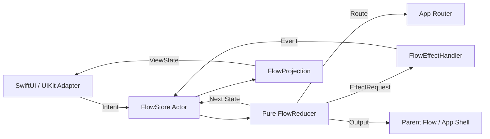

# IntentFlow for iOS

[](https://github.com/emrecanozturk/intentflow-ios/actions/workflows/ci.yml)
[](https://github.com/emrecanozturk/intentflow-ios/actions/workflows/docs.yml)

IntentFlow is a workflow-first architecture for iOS apps.

It treats a feature as explicit product behavior:

```text
State + Intent/Event -> Next State + Effects + Outputs + Routes
```

The goal is not to invent another folder naming convention. MVC, MVVM, VIPER, Clean, Coordinators, Redux, MVI, TCA, and RIBs all solved real problems. IntentFlow starts where those patterns usually become unclear: async workflows, side effects, cancellation, navigation, recovery, observability, and AI-assisted code generation.

## Why This Exists

Most iOS architectures still center the screen:

```text
View -> ViewModel/Presenter -> UseCase -> Repository
```

Real product behavior is not screen-shaped. A login feature is not a view model. A checkout feature is not a presenter. A device connection feature is a workflow:

```text
idle
scanning
choosingDevice
connecting
waitingForTrust
verifyingInternet
ready
failed(reason)
```

IntentFlow makes that workflow the primary artifact. UI becomes an adapter. Effects become typed and cancellable. Navigation becomes route output. Tests run against behavior without booting a screen.

## Two Flavors

IntentFlow ships in two modes.

| Mode | Use When | Includes |
|---|---|---|
| IntentFlow Core | You want a lightweight architecture humans can use without a framework-heavy commitment. | State, Intent, Event, Effect, Output, Route, pure reducer, effect handler, store, projection, tests. |
| IntentFlow AI | You want AI-assisted generation and stricter guardrails. | Everything in Core plus `.intentflow.yaml`, invariants, acceptance traces, Cursor rules, Copilot instructions, generator support, validation. |

Core is the architecture.

AI mode is the architecture plus a machine-readable contract so AI tools know what they are allowed to change.

## AI Agent Support

IntentFlow includes provider-specific instruction surfaces so AI tools can work from the same architecture contract:

| Tool | Files |
|---|---|
| Codex | `AGENTS.md`, `.ai/agent-context.md` |
| Claude Code | `CLAUDE.md`, `.claude/rules/*.md` |
| Gemini CLI | `GEMINI.md`, `.geminiignore` |
| GitHub Copilot | `.github/copilot-instructions.md`, `.github/instructions/*.instructions.md` |
| Cursor | `.cursor/rules/intentflow.mdc` |

Generate compact context for an agent instead of loading the whole repository:

```bash
swift run intentflow ai-context .intentflow/login.intentflow.yaml --tool codex
```

See [AI Agent Usage](docs/ai/agent-usage.md) and [Context Budgeting](docs/ai/context-budgeting.md).

## What It Completes

| Existing Pattern | What It Gets Right | What IntentFlow Adds |
|---|---|---|
| MVC | Simple and native to Cocoa. | Prevents Massive View Controller by moving behavior into explicit workflows. |
| MVVM | Good UI/presentation separation. | Stops ViewModels from absorbing navigation, async retry, cancellation, analytics, and permission logic. |
| Coordinator | Moves navigation out of view controllers. | Represents navigation as route output from behavior, not imperative controller calls. |
| VIPER | Strong responsibility boundaries. | Keeps boundaries without forcing every feature into many files and generators. |
| Clean Architecture | Strong dependency direction. | Keeps dependency discipline while avoiding unnecessary DTO/use-case/repository ceremony for every screen. |
| Redux/MVI/UDF | State and events are visible and testable. | Adds typed effects, routes, outputs, cancellation IDs, and iOS adapter guidance. |
| TCA | Excellent reducer/effect/testing model. | Offers a smaller, framework-light option and an AI contract layer. |
| RIBs | Great for nested workflows at scale. | Keeps workflow thinking but makes adoption smaller and easier for normal app teams. |

## Architecture Shape



Every feature starts with the contract:

```swift
enum LoginState: Equatable, Sendable {
    case idle
    case validating(String)
    case requestingToken
    case waitingForTwoFactor
    case failed(String)
    case authenticated(String)
}

enum LoginIntent: Equatable, Sendable {
    case submit(email: String, password: String)
    case submitTwoFactor(String)
    case cancel
}

enum LoginEvent: Equatable, Sendable {
    case credentialsValid
    case tokenRequiresTwoFactor
    case tokenReceived(String)
    case tokenFailed(String)
}
```

Then the reducer owns behavior:

```swift
struct LoginFlow: FlowReducer {
    func reduce(
        state: LoginState,
        signal: FlowSignal<LoginIntent, LoginEvent>
    ) -> Next<LoginState, LoginEffect, LoginOutput, LoginRoute> {
        switch (state, signal) {
        case (.idle, .intent(.submit(let email, let password))):
            return .state(.validating(email))
                .effect(
                    .validate(email: email, password: password),
                    id: "login.validate",
                    policy: .cancelInFlight
                )

        case (.requestingToken, .event(.tokenReceived(let userID))):
            return .state(.authenticated(userID))
                .output(.completed(userID: userID))

        default:
            return .state(state)
        }
    }
}
```

## Installation

Add the package to `Package.swift`:

```swift
.package(url: "https://github.com/emrecanozturk/intentflow-ios.git", from: "0.1.0")
```

Then depend on the target:

```swift
.product(name: "IntentFlow", package: "intentflow-ios")
```

For AI mode:

```swift
.product(name: "IntentFlowAI", package: "intentflow-ios")
```

## Generate a Feature

```bash
swift run intentflow feature Checkout --mode ai --ui swiftui --output ./Sources/Features
```

Generated files:

```text
Checkout/
  CheckoutContract.swift
  CheckoutFlow.swift
  CheckoutEffects.swift
  CheckoutProjection.swift
  CheckoutFlowTests.swift
  Checkout.intentflow.yaml
```

## Examples

- [Buildable Demo App](Examples/IntentFlowDemoApp)
- [SwiftUI Device Connection](Examples/SwiftUIExample)
- [UIKit Upload Retry](Examples/UIKitExample)
- [MVVM to IntentFlow Migration](Examples/Migration/MVVMToIntentFlow)

The examples intentionally model workflows that MVVM view models often absorb: trust checks, connection state, progress, retry, cancellation, and output routing.

## AI Mode

AI mode adds a manifest:

```yaml
schemaVersion: "0.1"
feature: "Login"
mode: "ai"
states:
  - idle
  - validating
  - requestingToken
  - waitingForTwoFactor
  - failed(message)
  - authenticated(userID)
invariants:
  - "A token must not be persisted before authentication succeeds."
  - "Two-factor code can only be submitted from waitingForTwoFactor."
acceptanceTraces:
  - "idle + submit(valid form) -> validating + validate effect"
  - "requestingToken + tokenReceived -> authenticated + completed output"
```

The manifest is not documentation only. It is the contract used by rules, generators, validation, and AI prompts.

See [IntentFlow AI](docs/ai/intentflow-ai.md).

## Testing

Reducers are pure, so behavior can be tested without UI:

```swift
let trace = LoginFlow().trace(
    initialState: .idle,
    signals: [
        .intent(.submit(email: "emre@example.com", password: "secret")),
        .event(.credentialsValid),
        .event(.tokenRequiresTwoFactor)
    ]
)

XCTAssertEqual(trace.steps.map(\.state), [
    .validating("emre@example.com"),
    .requestingToken,
    .waitingForTwoFactor
])
```

The included package currently verifies:

- pure reducer traces
- cancellation requests
- actor-backed store execution
- observation snapshots
- AI manifest validation
- generator smoke tests

Run:

```bash
swift test
swift run intentflow validate .intentflow/login.intentflow.yaml
```

## Documentation

- [Pattern Research Matrix](docs/rationale/pattern-research-matrix.md)
- [Manifesto](docs/manifesto.md)
- [Design Principles](docs/rationale/design-principles.md)
- [IntentFlow AI](docs/ai/intentflow-ai.md)
- [AI Agent Usage](docs/ai/agent-usage.md)
- [Context Budgeting](docs/ai/context-budgeting.md)
- [Migration Guide](docs/migration/migration-guide.md)
- [Memory and Concurrency](docs/advanced/memory-and-concurrency.md)
- [Generator](docs/generator.md)
- [Roadmap](ROADMAP.md)

## Project Status

This is an experimental 0.1 architecture proposal.

The public promise is intentionally small:

- make product behavior explicit
- keep effects outside reducers
- keep UI as an adapter
- keep routes and outputs typed
- make tests describe workflows
- make AI generation constrained by a contract

## Core Sentence

Architecture is not folder structure. Architecture is executable product behavior.
